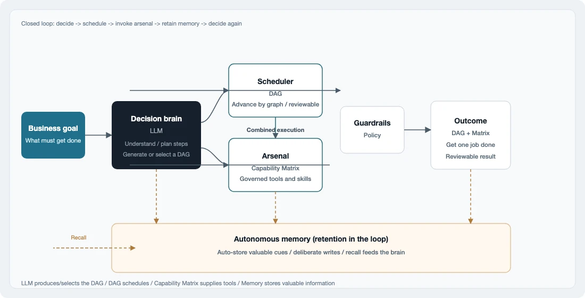

# Neo Agent

Neo Agent is a portable, goal-oriented agent runtime. It completes bounded work—status checks, material organization, SOP-style ops, repo-side execution—inside explicit policy: goals land on an allow-listed capability set and run by graph. Not a chat toy. Not the strongest coding IDE. Its core is orchestration you can trust: goals stay composable, capabilities stay governed, boundaries stay enforced, memory stays on-host. The same contract spans a single-machine CLI through industrial edge, embodied platforms, and plant linkage—cloud intelligence wired into real systems. What ships today is the lightweight on-host runtime.

<p align="center">
  
</p>

What each piece does in the loop:

1. **LLM** — decision brain: understand the goal, plan steps, generate or select a DAG.
2. **DAG** — scheduler: advance by agreed topology; paths stay reviewable.
3. **Capability Matrix** — arsenal: allow-listed tools (builtins / commands / MCP / directory packs).
4. **Policy** — guardrails: defaults-deny, allow-lists, and resource limits.
5. **Memory** — autonomous retention: on-host store and recall that feed later decisions.

The execution spine is **DAG ∥ Capability Matrix ∥ Policy**; LLM and Memory close the loop on decision and cross-session retention. Deployment stays light: change config per environment.

---

## Features

1. Single-turn chat — `./neo "…"` (OpenAI-compatible API)
2. Plan / plan+run — `neo plan` / `neo run "goal"`
3. Named DAG — `neo dag run NAME` (`dags/` catalog)
4. Declarative DAG — `tool` / `llm` / `loop` / `route`
5. Capability Matrix — builtins, allow-listed commands, packs under `capabilities/`
6. MCP (stdio) — `mcp_servers` → `mcp_<server>_<tool>`
7. Policy — shell / HTTPS allow-list / path sandbox / turn and byte limits
8. Named CLI sessions — default id `default`; `-S ID`; `--session-list` / `--session-clear`
9. Multi-session mix — `-S a,b` loads in order; writes the turn to the **first** ID only
10. New default session — `-N` / `--session-new` archives `default` → `YYYYMMDD-HHMMSS`, then chats on fresh `default`
11. Daemon multi-turn — `neo daemon` / `-D` / `--daemon` / `--socket`; interactive `User>` / `neo>` + Markdown; UTF-8 erase (`IUTF8`); in-memory turns, independent of `-S` files
12. On-host vector memory — recall, heuristic auto-store, `memory_add`, `memory store|recall`
13. Terminal Markdown — on by default (md4c); `--no-render` for raw text
14. Profiles / diagnostics — `-p` / `-m` / `-v` / `-d`
15. Claw prompt blocks — soul / bootstrap / rules / memory ([`docs/claw.md`](docs/claw.md))
16. JSON5 config — top-level `capability_matrix`
17. Session roles — `--role NAME` with config `roles`; shared `-S` history; assistant saved as `[NAME] …`
18. Machine output — `-j` / `--json` OpenAI `chat.completion` JSON; `-o FILE` writes reply/JSON (or plan DAG)

---

## Install

macOS or Linux, plus a reachable LLM API.

```bash
make
cp config/config.json5.example config/config.json5
# Set api_key and model; enable memory.vector if you want autonomous memory
./neo "Who are you?"
```

---

## Usage

```bash
./neo "In three sentences, what is Neo Agent good for?"
./neo --no-render "Same, raw Markdown / plain text"
./neo "follow-up on the default session"
./neo -N "start fresh (archives default → YYYYMMDD-HHMMSS)"

./neo -S ship "How do I build a spaceship?"
./neo -S ship "Option 4 in detail"
./neo -S ship,cook "Combine both threads"
./neo --session-list
./neo --session-clear ship

# Same session, switch roles (requires config roles{})
./neo -S ship --role researcher "Research spaceships first"
./neo -S ship --role writer "Turn that into a short article"

./neo dag run show_time
./neo run "show the system time"
./neo plan "summarize recent work in this repo"

./neo -j "reply as JSON for scripts"
./neo -o /tmp/reply.txt "write reply to file only"
./neo -j -o /tmp/reply.json "JSON object written to file"
```

Common entry points:

1. Chat — `./neo "…"` (uses session `default`; Markdown on; `--no-render` for raw)
2. New default session — `./neo -N "…"` (archive `default`, then chat)
3. Named sessions — `./neo -S id` / `-S a,b`
4. JSON / file — `./neo -j "…"` / `./neo -o FILE "…"` / `./neo -j -o FILE "…"`
5. DAG — `./neo dag run <name>` / `./neo run <name|"goal">` / `./neo plan "goal"`
6. Multi-turn — `./neo -D` (or `daemon` / `--daemon`) / `--socket PATH`
7. Memory — `./neo memory store|recall "…"`
8. Profile — `./neo -p demo …`

More examples: [`docs/manual.md`](docs/manual.md) (user manual), [`docs/examples.md`](docs/examples.md), [`example/usage/`](example/usage/). Matrix and DAG: [`docs/tool.md`](docs/tool.md), [`docs/dag.md`](docs/dag.md).

---

## Memory

On-host vector memory; no external embedding service. With `memory.vector` enabled, remember/prefer-style intents can auto-store; the model may also call `memory_add`.

```json5
memory: {
  path: "MEMORY.md",
  max_chars: 4000,
  vector: {
    enabled: true,
    store: ".neo/memory.vdb",
    top_k: 5,
    dims: 64,
    auto_store: { enabled: true, max_chars: 500 },
  },
}
```

1. Recall injects `## Memory` (no full `MEMORY.md` fallback)
2. Heuristic `auto_store` (`-v` logs)
3. Data under `vector.store` (default `.neo/`); in-process embeddings

Details: [`docs/claw.md`](docs/claw.md).

---

## Build

```bash
make
make test
```

Contributing: [`AGENTS.md`](AGENTS.md). Architecture: [`docs/architecture.md`](docs/architecture.md).

中文：[`README_zh.md`](README_zh.md)
