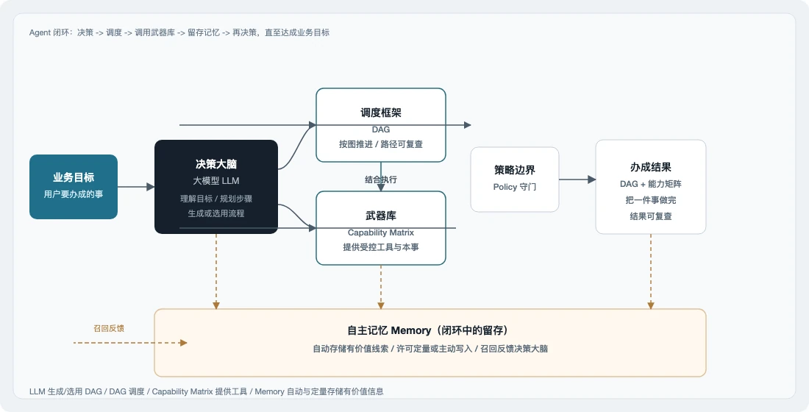

# Neo Agent

Neo Agent 是面向明确目标的可移植 Agent 运行时。它在可控边界内完成状态核查、材料整理、SOP 运维、仓库旁路执行等一类工作：目标进入白名单能力清单，按图调度落地——不是闲聊机器人，也不是最强编码 IDE。核心能力是目标可编排、能力可治理、边界可强制、记忆留在本机。同一套契约覆盖从单机 CLI 到工业边缘、具身平台与厂区联动，把云端智能接到真实系统并跑稳；当前交付以本机轻量运行为主。

<p align="center">
  
</p>

闭环里各块的职责：

1. **LLM** — 决策大脑：理解目标，规划步骤，生成或选用 DAG。
2. **DAG** — 调度框架：按约定拓扑推进，路径可复查。
3. **Capability Matrix** — 武器库：清单内工具与本事（builtin / 命令 / MCP / 目录包）。
4. **Policy** — 守门：默认禁止、白名单与资源上限。
5. **Memory** — 自主记忆：本机写入与召回，反哺后续决策。

执行脊梁是产品三角 **DAG ∥ Capability Matrix ∥ Policy**；LLM 与 Memory 分别补上决策与跨会话留存。部署偏轻量：换环境改配置即可。

---

## Features

1. 单次对话 — `./neo "…"`（OpenAI 兼容 API）
2. 规划 / 规划并执行 — `neo plan` / `neo run "目标"`
3. 具名 DAG — `neo dag run NAME`（`dags/` catalog）
4. 声明式 DAG — `tool` / `llm` / `loop` / `route`
5. Capability Matrix — builtin、白名单命令、`capabilities/` 目录包
6. MCP（stdio）— `mcp_servers` → `mcp_<server>_<tool>`
7. Policy — shell / HTTPS 白名单 / 路径沙箱 / 轮次与字节上限
8. 具名会话 — 默认 id `default`；`-S ID`；`--session-list` / `--session-clear`
9. 多会话混合 — `-S a,b` 按序注入，本轮只写回第一个 ID
10. 新开默认会话 — `-N` / `--session-new` 将 `default` 归档为 `YYYYMMDD-HHMMSS` 后重新聊
11. Daemon 多轮 — `neo daemon` / `-D` / `--daemon` / `--socket`；交互式 `User>` / `neo>` + Markdown；UTF-8 退格（`IUTF8`）
12. 本机向量记忆 — 召回、启发式写入、`memory_add`、`memory store|recall`
13. 终端 Markdown — 默认开启（md4c）；`--no-render` 输出原文
14. Profile / 诊断 — `-p` / `-m` / `-v` / `-d`
15. Claw 拼装 — soul / bootstrap / rules / memory（[`docs/claw.md`](docs/claw.md)）
16. JSON5 配置 — 顶层键 `capability_matrix`
17. 会话角色 — `--role NAME` + 配置 `roles`；同一 `-S` 共享历史；落盘 `[NAME] …`
18. 机读输出 — `-j` / `--json` 为 OpenAI `chat.completion` JSON；`-o FILE` 写回复/JSON（或 plan DAG）

---

## Install

需要 macOS 或 Linux，以及可达的大模型 API。

```bash
make
cp config/config.json5.example config/config.json5
# 填写 api_key、model；需要记忆时开启 memory.vector
./neo "你是谁"
```

---

## Usage

```bash
./neo "用三句话说明 Neo Agent 适合做什么"
./neo --no-render "同上，输出原始 Markdown"
./neo "在默认会话里继续"
./neo -N "新开默认会话（先归档 default）"

./neo -S ship "飞船怎么做"
./neo -S ship "展开第 4 种"
./neo -S ship,cook "结合两边继续"
./neo --session-list
./neo --session-clear ship

# 同会话切换角色（须配置 roles）
./neo -S ship --role researcher "先调研飞船"
./neo -S ship --role writer "根据上文写成短文"

./neo dag run show_time
./neo run "查看系统时间"
./neo plan "梳理仓库近期工作重点"

./neo -j "给脚本用的 JSON"
./neo -o /tmp/reply.txt "只写入文件"
./neo -j -o /tmp/reply.json "JSON 写入文件"
```

常用入口：

1. 问答 — `./neo "…"`（默认会话 `default`；默认渲染 Markdown；`--no-render` 出原文）
2. 新开默认会话 — `./neo -N "…"`（归档 `default` 后再聊）
3. 具名会话 / 混合 — `./neo -S id` / `-S a,b`
4. JSON / 文件 — `./neo -j "…"` / `./neo -o FILE "…"` / `./neo -j -o FILE "…"`
5. DAG — `./neo dag run <名>` / `./neo run <名|"目标">` / `./neo plan "目标"`
6. 多轮 — `./neo -D`（或 `daemon` / `--daemon`）/ `--socket PATH`
7. 记忆 — `./neo memory store|recall "…"`
8. Profile — `./neo -p demo …`

更多样例：[`docs/manual.md`](docs/manual.md)（使用手册）、[`docs/examples.md`](docs/examples.md)、[`example/usage/`](example/usage/)。矩阵与 DAG：[`docs/tool.md`](docs/tool.md)、[`docs/dag.md`](docs/dag.md)。

---

## Memory

本机向量记忆，不依赖外部 embedding 服务。启用 `memory.vector` 后可自动识别「记住 / 偏好」类意图写入；模型也可调用 `memory_add`。

```json5
memory: {
  path: "MEMORY.md",
  max_chars: 4000,
  vector: {
    enabled: true,
    store: ".neo/memory.vdb",
    top_k: 5,
    dims: 64,
    auto_store: { enabled: true, max_chars: 500 },
  },
}
```

1. 召回注入 `## Memory`（不再回退读满篇 `MEMORY.md`）
2. `auto_store` 启发式写入（`-v` 可见日志）
3. 数据落在 `vector.store`（默认 `.neo/`），进程内 embedding

说明：[`docs/claw.md`](docs/claw.md)。

---

## Build

```bash
make
make test
```

贡献约定见 [`AGENTS.md`](AGENTS.md)；架构见 [`docs/architecture.md`](docs/architecture.md)。

English: [`README.md`](README.md)
